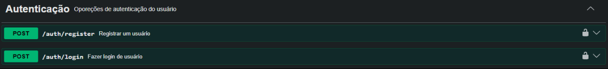
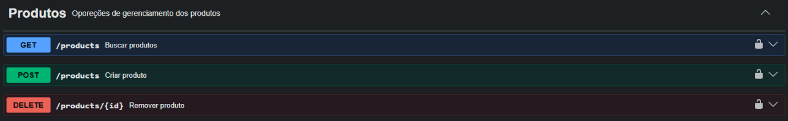
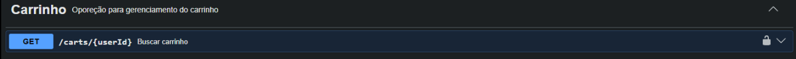
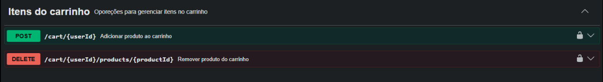

#  E-Commerce API

REST API desenvolvida em Java com Spring Boot para simular o backend de uma plataforma de e-commerce.

O projeto implementa autenticação e autorização com Spring Security e JWT, gerenciamento de usuários e produtos, além de funcionalidades de carrinho de compras e controle de estoque.

## Tecnologias

- Java 21
- Spring Boot 4.1.0
- Spring Web MVC
- Spring Data JPA
- Hibernate
- Spring Security
- JWT
- MySQL
- Bean Validation
- Lombok
- Maven
- Docker
- Docker Compose
- Springdoc OpenAPI / Swagger

##  Funcionalidades

###  Autenticação

- Cadastro de usuários
- Login de usuários
- Autenticação utilizando JWT
- Criptografia de senhas com BCrypt
- Autorização baseada em roles (`USER` e `ADMIN`)
- Proteção dos endpoints através do Spring Security

###  Produtos

- Listagem de produtos
- Cadastro de produtos
- Exclusão de produtos
- Controle de estoque
- Validação de permissões por perfil

###  Carrinho

- Consulta do carrinho de um usuário
- Adição de produtos ao carrinho
- Remoção de produtos do carrinho
- Controle da quantidade de produtos
- Atualização do estoque após adicionar ou remover produtos

###  Testes

O projeto possui testes unitários e testes de camada web utilizando:

- JUnit
- Mockito
- MockMvc
- Spring Boot Test

Os testes cobrem principalmente as regras de negócio dos services e os comportamentos HTTP dos controllers.

##  Documentação da API

A API possui documentação através do Swagger/OpenAPI.

Após iniciar a aplicação, a documentação pode ser acessada em:

```text
http://localhost:8080/swagger-ui/index.html
```


##  Principais endpoints

### Autenticação



### Produtos



### Carrinho



### Itens do carrinho



## Autorização

A API utiliza JWT para autenticação.

Os endpoints de autenticação são públicos:

```text
POST /auth/register
POST /auth/login
```

Os demais endpoints exigem autenticação.

As permissões são separadas por roles:

```text
USER
ADMIN
```

Exemplo:

- `USER` pode consultar produtos.
- `ADMIN` pode cadastrar e remover produtos.

##  Executando com Docker

O projeto possui um `docker-compose.yml` configurado para executar o MySQL em um container.

### 1. Clone o repositório

```bash
git clone https://github.com/LuanDonorato/ecommerce-api.git
```

```bash
cd ecommerce-api
```

### 2. Configure as variáveis de ambiente

Crie um arquivo `.env` na raiz do projeto:

```env
MYSQL_DATABASE=ecommerce
MYSQL_USER=appuser
MYSQL_PASSWORD=your_password
MYSQL_ROOT_PASSWORD=your_root_password
```

### 3. Inicie o banco de dados

```bash
docker compose up -d
```

O Docker Compose utiliza MySQL 8.0 e mantém os dados através de um volume persistente.

### 4. Execute a aplicação

Com o banco de dados em execução, execute o projeto através do Maven:

```bash
./mvnw spring-boot:run
```

No Windows:

```bash
mvnw.cmd spring-boot:run
```

A API estará disponível em:

```text
http://localhost:8080
```

## Estrutura do projeto

O projeto utiliza uma arquitetura em camadas, separando responsabilidades entre controllers, services, repositories, entities e DTOs.

```text
src
└── main
    └── java
        └── com.luand.ecommerce_api
            ├── config
            ├── controller
            ├── dto
            ├── entity
            ├── enums
            ├── exception
            ├── handler
            ├── repository
            ├── service
            └── EcommerceApiApplication.java
```

### Principais responsabilidades

**Controller**

Responsável pelos endpoints HTTP e comunicação com o cliente.

**Service**

Concentra as regras de negócio da aplicação.

**Repository**

Responsável pelo acesso e persistência dos dados utilizando Spring Data JPA.

**Entity**

Representa as entidades persistidas no banco de dados.

**DTO**

Utilizado para transportar dados entre a API e o cliente, evitando expor diretamente os objetos utilizados nas requisições.

**Config**

Contém as configurações relacionadas à segurança e autenticação da aplicação e do SpringDoc.

##  Testes

Para executar os testes:

```bash
./mvnw test
```

No Windows:

```bash
mvnw.cmd test
```

Os testes utilizam JUnit, Mockito e MockMvc para validar regras de negócio e respostas dos endpoints.

## Objetivo

Este projeto foi desenvolvido com o objetivo de praticar e consolidar conceitos de desenvolvimento backend com Java e Spring Boot, incluindo:

- Desenvolvimento de APIs REST
- Arquitetura em camadas
- Persistência com JPA/Hibernate
- Autenticação e autorização
- JWT
- Spring Security
- Validação de dados
- Tratamento de exceções
- Testes unitários
- Testes de controllers
- Integração com MySQL
- Containerização com Docker

##  Autor

**Luan Donorato**

GitHub:  
https://github.com/LuanDonorato
